# NineTailFox Adventure (이승현, 임형균)

# 1. 컨셉

## 메인컨셉 : 
-상호작용/인터렉티브한 게임을 만들게되면 플레이어가 더 다양하고 많은 플레이 경험을 쌓으며 재밌게 플레이할 수 있게하기 위함

### 서브 컨셉 1 : 
-탈출 / 함정을 피하고 가로막는 것들을 피하여 탈출하는것에 재미를 주기위해 특정 환경과 특정 동뭄과의 상호작용으로만 탈출 할 수 있게 함

### 서브 컨셉 2 : 
-구출 / 플레이어 캐릭터의 다양성과 시각적 재미를 위해 구출시킴으로서 다양한 동물캐릭터를 조작하게 함

### 서브 컨셉 3 : 
-변신 / 변신키를 눌러 구출한 동물들로 변신을 하여 동물에 따른 특성을 적재적소에 활용해 탈출함

### 서브 컨셉 4 : 
-퍼즐 / 알맞은 환경과 동물캐릭터를 맞추어 상호작용으로 탈출하는 것을 구현하고 탈출요소에 퍼즐요소를 추가하여 진행시킬 예정이다

### 서브 컨셉 5 : 
-타이밍 / 타이밍 노트시스템을 추가하여 타이밍을 잡기위해 집중해야 하도록 만들 예정이다.

   

# 2. 관련 이미지 & 동영상

# 3. 대표 이미지

# [컨셉 & 대표이미지 기반 작품묘사] ---아직 자료없음.

> ### 대표이미지 기반 :

> ### 컨셉 기반:

# [<게임제목> 구성 요소]
 
제목 : NineTailFox Adventure

## 1. 메커니즘

도전과제 : 
-주인공인 구미호 캐릭터가 정신을 차려보니 영문도 모르는 곳에 있었다.그곳에서 여러 장애물들을 헤쳐나가고, 동료 동물들을 만나면서 탈출을 하려고 시도한다.

재미요소 : 
-구미호가 다른 동물로 변신하여 그 동물의 특징을 이용해야만하는 장애물들을 전략적으로 클리어하면서 여러 상호작용을 통해 재미와 성취감을 느낄 수 있다.

## 2. 이야기

만들게 된 배경 : 
-처음에는 스테이지식의 탈출게임을 만들고 싶었다. 하지만 형균이와 얘기하다보니 스테이지형식보단 중간중간 세이브를 할 수 있고 한번에 쭉 플레이하는 방식이 더 좋다고 생각했다. 
 그러면서 어떤 캐릭터로 탈출하면 좋을까를 생각하다가 변신술이 능한 구미호를 주인공으로 하면 좋겠다는 생각을 하게 되었다.

참신함 : 
-보통 탈출 게임은 캐릭터는 이동만 하고 맵에 신경을 많이 쓰는데, 우리 게임은 캐릭터 또한 상황에 알맞게 변신하여야 한다는 점이 참신하다고 생각한다.

카메라 관점 : 
-캐릭터를 기준으로 백뷰로 캐릭터의 등을 바라보고 기본적으로 플레이하게 된다.

## 3. 미적요소
디자인 : 
-low poly의 동물디자인을 활용할 것이며, 그게 알맞는 레벨디자인을 구상할 것이다.

컬러 : 
-전체적인 맵 색상은 어두운 느낌의 분위기를 띄도록 할 것이다. 그에 비해 캐릭터들은 밝은 색상을 활용하여 캐릭터에 좀 더 집중되도록 할 것이다.

음향 : 
-각 동물들의 기본적인 발소리와 게임 전체적으로 잔잔한 BGM, 그리고 각 장애물이나 오브젝트  상호작용에 따른 사운드가 들어갈 것이다.

## 4. 기술
Unity를 활용하여 C#을 통해 PC기반의 게임을 만들 계획이다. 키보드를 통해 조작이 가능하다.

# [게임 시스템 디자인]

1. 게임 오브젝트 분해 (구성 요소 분석)

|연번|종류|OBJ한글이름|OBJ영어이름|사용처|이미지|
|------|-----|-----|-----|-----|---|
|1|플레이어|플레이어|Player|공통|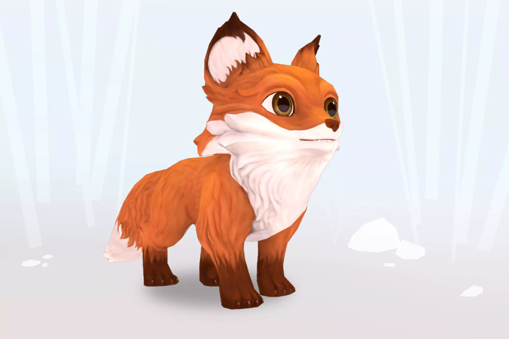|
|2|세이브포인트|세이브포인트|Save|게임 진행 중간중간|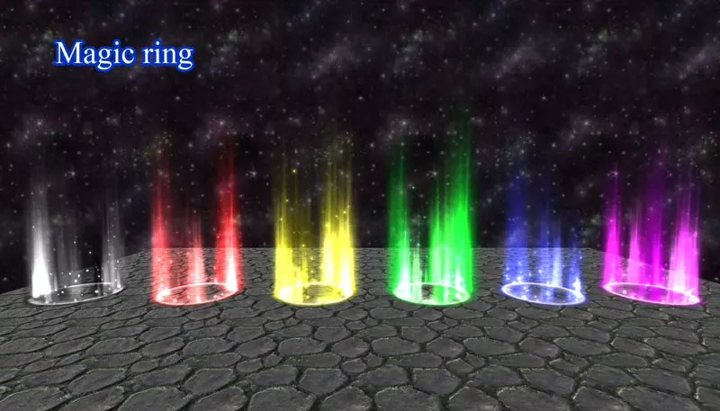|
|3|레벨|맵|Map|공통|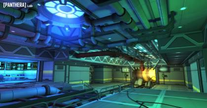|
|4|퍼즐|퍼즐|Puzzle|게임 중,후반부|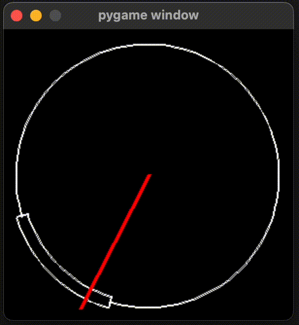|
|5|동물|참새|Bird|첫 세이브포인트 전까지|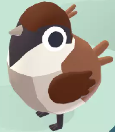|
|6|동물|뱀|Snake|첫째 세이브 포인트부터 두번째 세이브 포인트 전까지|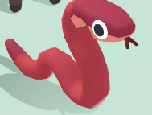|
|7|동물|양|Sheep|두번째 세이브 포인트부터 세번째 세이브 포인트 전까지|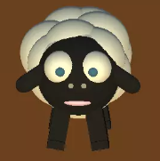|
|8|동물|원숭이|Monkey|세번째 세이브 포인트부터 네번째 세이브 포인트 전까지|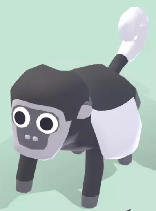|
|9|동물|물고기|Fish|네번째 세이브 포인트부터 다섯번째 세이브 포인트 전까지|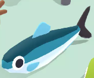|
|10|UI|플레이어초상화|PlayerUI|화면 왼쪽 하단에 플레이어 캐릭터의 초상화를 보여줌|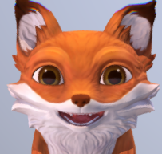|
|11|UI||동료동물 초상화|화면 왼쪽 상단에 구출한 동물들의 초상화를 보여줌||
|12|장애물|높은 벽|TallWall|첫 세이브 포인트 전까지|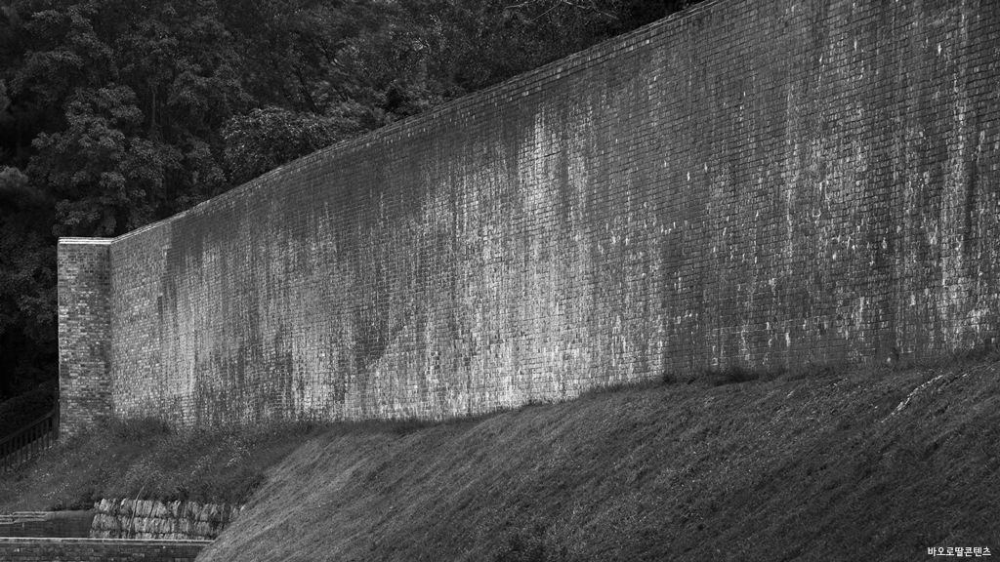|
|13|장애물|좁은 길|TightRoad|첫째 세이브 포인트부터 두번째 세이브 포인트 전까지||
|14|장애물|깊은낭떠러지|DeepCliff|두번째 세이브 포인트부터 세번째 세이브 포인트 전까지|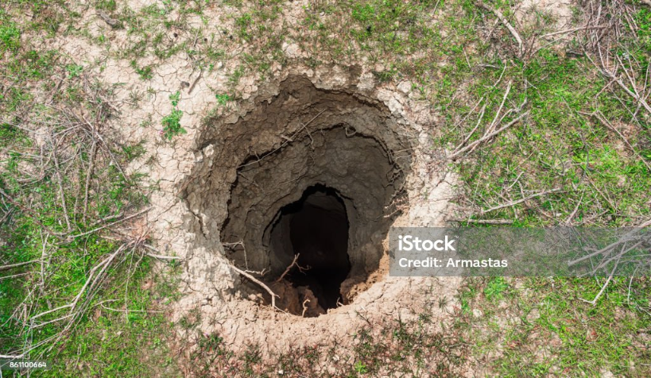|
|15|장애물|정글짐|JungleGym|세번째 세이브 포인트부터 네번째 세이브 포인트 전까지|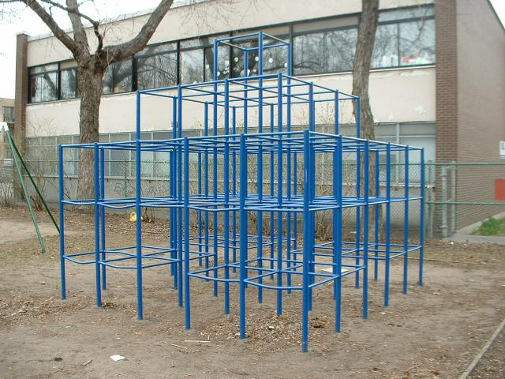|
|16|장애물|바다|Sea|네번째 세이브 포인트부터 다섯번째 세이브 포인트 전까지|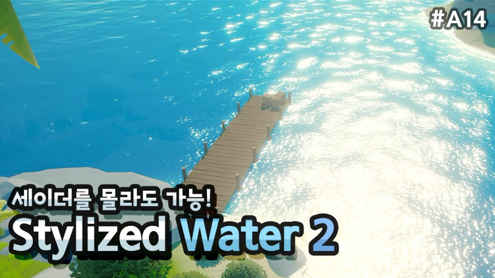|
|17|장애물|철퇴|IronBall|맵 중간중간 튀어나오는 장애물|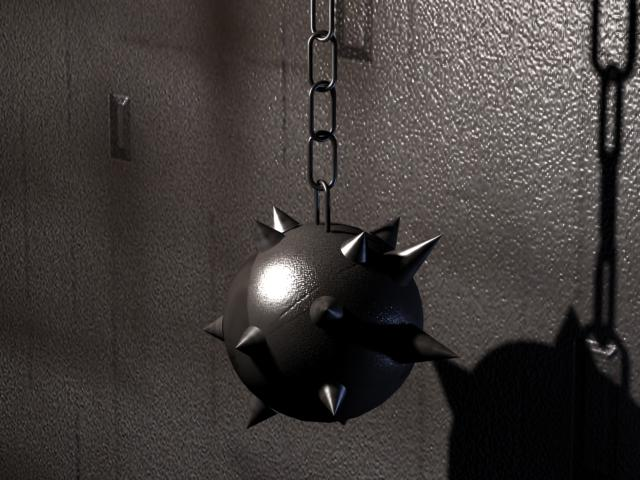|
|18|장애물|선풍기|Fan|첫 세이브포인트 전까지|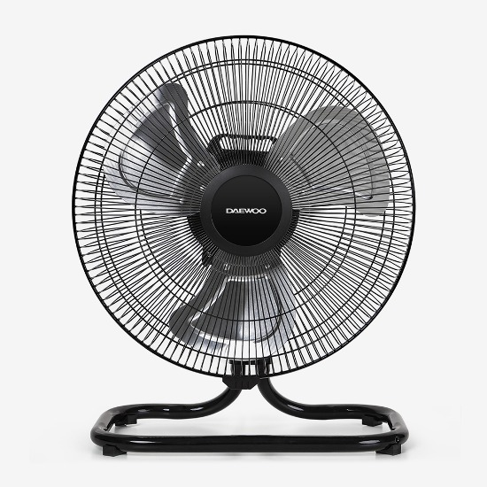|

2. 파라미터(속성) 뽑아 보기

1) 오브젝트 이름: Miho 외 동료 동물 8마리

|속성|영문명칭|설명|
|---|----|---|
|목숨|life|캐릭터의기회|
|스피드|speed|캐릭터의 이동 속도|
|상태|state|플레이어의 행동 상태,이동,사망|

2) 오브젝트 이름: Obstacle(장애물)

|속성|영문명칭|설명|
|---|----|---|
|활성화|activation|기본적인 함정과 장애물의 동작상태|
|비활성화|inactivation|레버 등을 이용하여 장애물이나 함정의 작동이 중지된 상태|

3) 오브젝트 이름: SavePoint(저장지점)

|속성|영문명칭|설명|
|---|----|---|
|활성화|activation|Player 오브젝트와 충돌하여 저장기능이 활성화된 상태|
|비활성화|inactivation|Save기능이 작동하기 전 기본상태|

