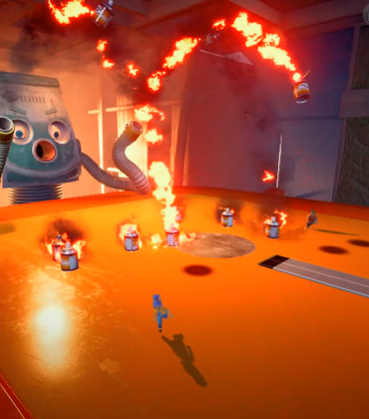
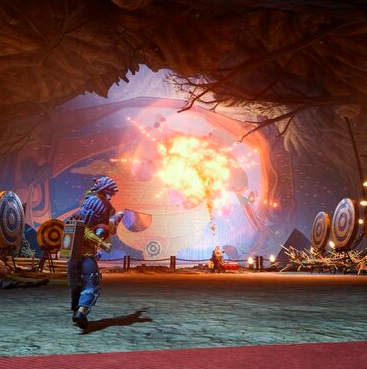
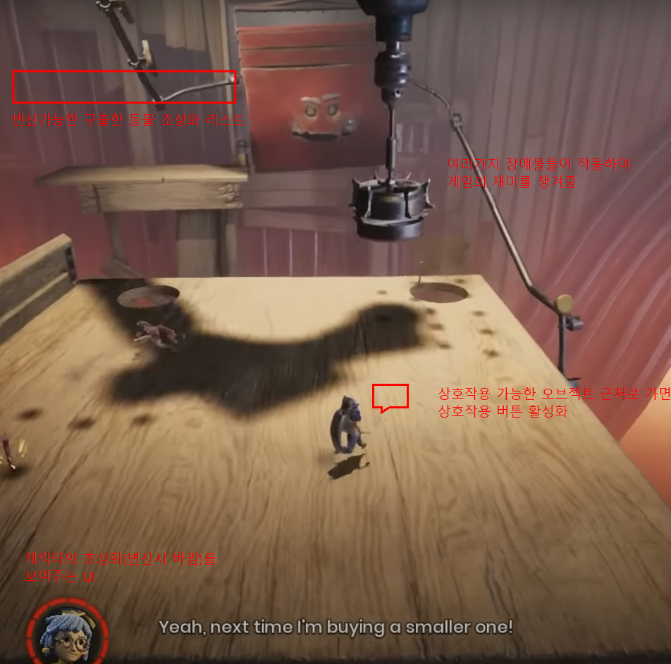

# NineTailFox Adventure

# 1. 컨셉

## 메인컨셉 : 
-상호작용/인터렉티브한 게임을 만들게되면 플레이어가 더 다양하고 많은 플레이 경험을 쌓으며 재밌게 플레이할 수 있게하기 위함

### 서브 컨셉 1 : 
-탈출 / 함정을 피하고 가로막는 것들을 피하여 탈출하는것에 재미를 주기위해 특정 환경과 특정 동뭄과의 상호작용으로만 탈출 할 수 있게 함

### 서브 컨셉 2 : 
-구출 / 플레이어 캐릭터의 다양성과 시각적 재미를 위해 구출시킴으로서 다양한 동물캐릭터를 조작하게 함

### 서브 컨셉 3 : 
-변신 / 변신키를 눌러 구출한 동물들로 변신을 하여 동물에 따른 특성을 적재적소에 활용해 탈출함

### 서브 컨셉 4 : 
-퍼즐 / 알맞은 환경과 동물캐릭터를 맞추어 상호작용으로 탈출하는 것을 구현하고 탈출요소에 퍼즐요소를 추가하여 진행시킬 예정이다

### 서브 컨셉 5 : 
-타이밍 / 타이밍 노트시스템을 추가하여 타이밍을 잡기위해 집중해야 하도록 만들 예정이다.

   

# 2. 관련 이미지 & 동영상

# 3. 대표 이미지

